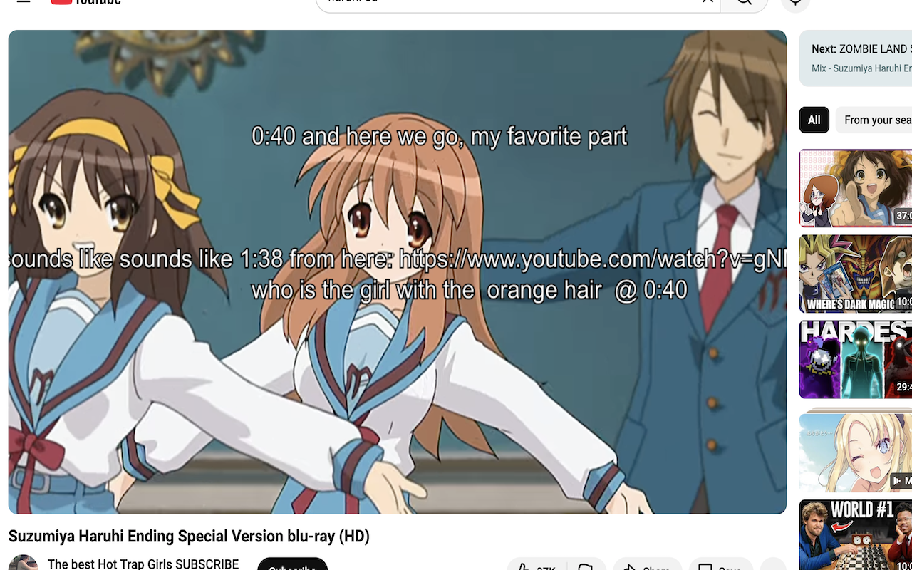

# niconico-yt

[](https://addons.mozilla.org/en-US/firefox/addon/niconico-yt/)
[](https://chromewebstore.google.com/detail/ljbjmghfdjlkacjaiceiadjgdoaedofk)

NicoNico-style comments on Youtube.



## Development

### Create an API key

Create a [GCP account](https://cloud.google.com/?hl=en).

Create a new project and enable YouTube Data API v3

Go to Credentials and create an API key. Restrict the API key to Youtube Data
API v3.

### Build extension

Create `.env` from `sample.env` and replace `API_KEY` with the API key from GCP.

Install dependencies and build extension with:

```
yarn install
yarn build
```

### Load extension

- Chrome
  - Go to `chrome://extensions/`
  - Click `Load unpacked` and select the `dist` folder
- Firefox
  - Go to `about:debugging`
  - Click `Load Temporary Add-on...` and select any file in the `dist` folder
